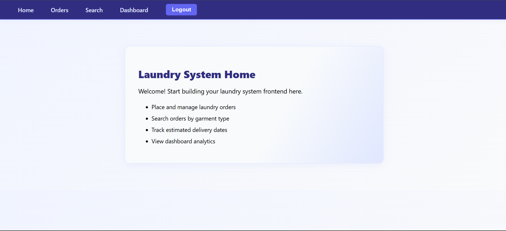
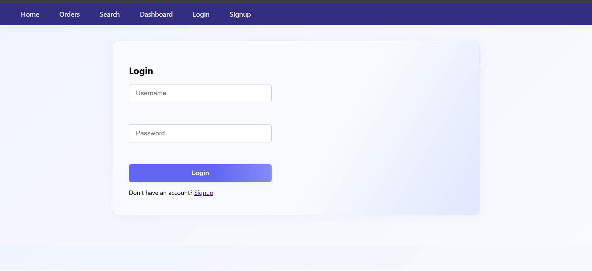
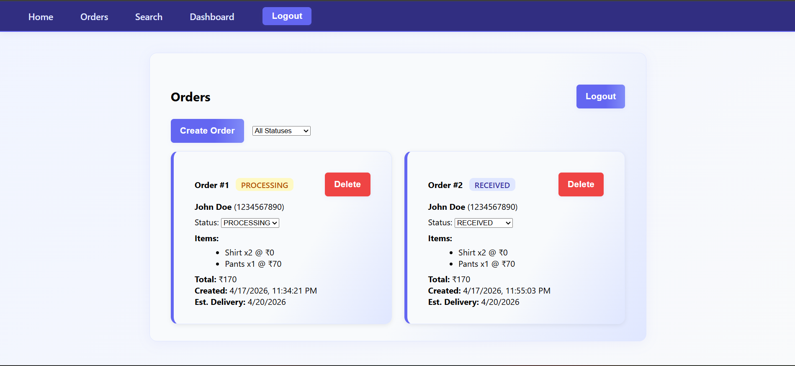
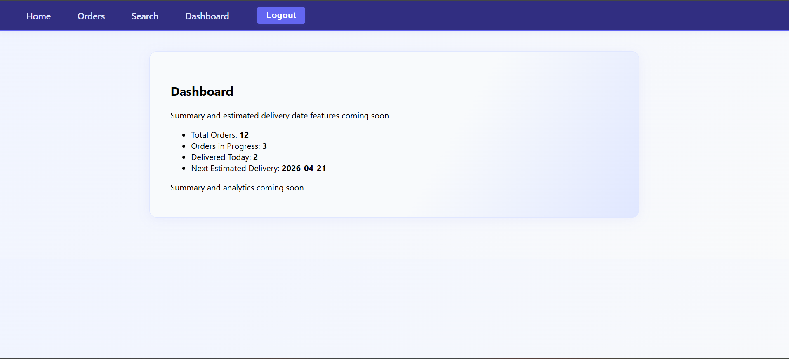
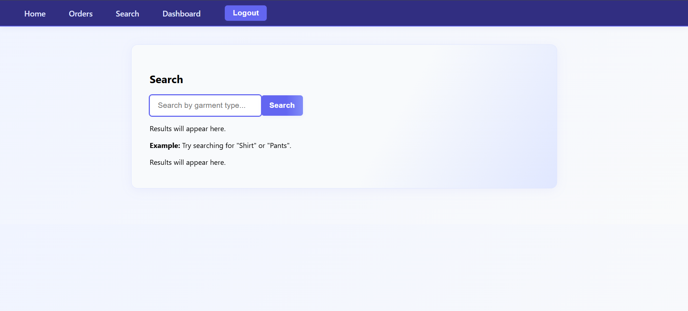

# Laundry Order Management System

## Project Overview
This is a full-stack Laundry Order Management System with a modern React frontend and a Flask backend (SQLite). It supports user authentication, order management, status tracking, and dashboard analytics.

## Setup Instructions

### Backend (Flask)
1. **Clone the repository:**
   ```
   git clone <your-repo-url>
   cd laundry-system
   ```
2. **Create and activate a virtual environment:**
   ```
   python -m venv venv
   # On Windows:
   venv\Scripts\activate
   # On Mac/Linux:
   source venv/bin/activate
   ```
3. **Install dependencies:**
   ```
   pip install -r requirements.txt
   ```
4. **Initialize the database:**
   ```
   python init_db.py
   ```
5. **Run the Flask server:**
   ```
   python app.py
   ```
   The backend runs at http://localhost:5000

### Frontend (React)
1. **Install dependencies:**
   ```
   cd frontend/frontend
   npm install
   ```
2. **Start the React app:**
   ```
   npm start
   ```
   The frontend runs at http://localhost:3000

## Features

- User authentication (signup, login, JWT-based sessions)
- Create, update, delete laundry orders
- Update order status (RECEIVED, PROCESSING, READY, DELIVERED)
- Filter orders by status
- Responsive, modern UI with color themes and modals
- Dashboard analytics (total orders, revenue, orders per status)
- Error handling and validation
- Logout and protected routes

## Usage

1. **Sign up and log in** from the frontend UI.
2. **Create, view, update, and delete orders** from the Orders page.
3. **Update order status** and filter orders by status.
4. **Log out** using the navigation bar.
5. **Dashboard** shows analytics (if implemented).

## Tech Stack
- Frontend: React, modern CSS
- Backend: Flask, Flask-JWT-Extended, SQLAlchemy, SQLite

## AI Usage Report

**Tools Used:**
- GitHub Copilot (VS Code)
- ChatGPT (OpenAI)

**What AI Got Wrong:**
- Sometimes generated code with circular imports (fixed by moving db to models/__init__.py)
- Missed registering blueprints in app.py (added manually)
- Generated duplicate or nested route definitions (cleaned up manually)

**What Was Improved:**
- Refactored code to use service layer for business logic
- Ensured all endpoints return clean JSON
- Added automatic table creation on app startup
- Improved error messages and validation

## Frontend Screenshot


## Application Screenshots

Below are screenshots of the main features and pages of the Laundry System frontend:

### Home Page


### Login Page


### Orders Page


### Dashboard


### Search


---
**UI/UX:**
- Navigation bar with color, hover, and active states
- Responsive cards and modals for order management
- Clean, modern layout and typography

---
**Contributors:**
- You & GitHub Copilot

---

Feel free to add screenshots, API samples, or a demo video for submission!
